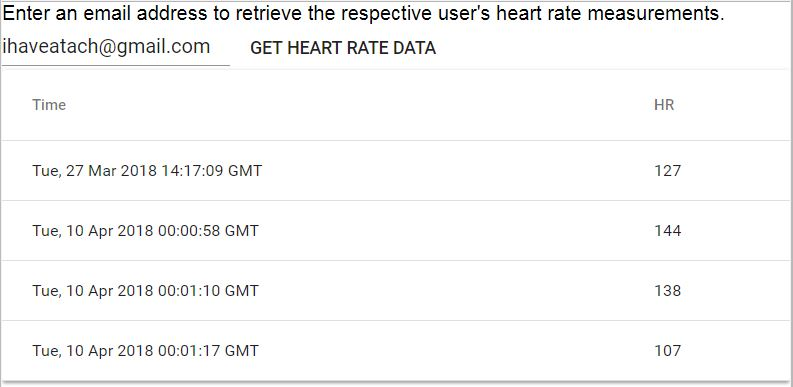

dr-hr-frontend
==============

Overview
--------
User interface created using React to interface with database of users and timestamped heart rates.  Allows you to search a user by email address and click a button to display that user's heart rate data in a table.


## Setup
```
pip install -r requirements.txt
npm install axios
npm run start
```

## Using the Application
Type an email address of an existing user in the database into the text field.  Click "GET HEART RATE DATA" and wait for table to be populated.


